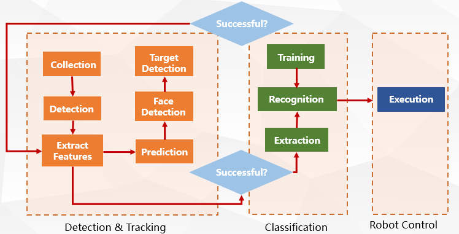

# Gesture Recognition Based Intelligent Human-Computer-Interaction Mobile Robot Design

Group Members: 赖鹏楠   童年  杨寒梅   黄珂邈   田闰心  林森

### Abstract

The intelligent human-computer-interaction is difficult to implement because of the security and accuracy problem. Compared with voice based interaction, gesture based interaction is more convenient and practical. There are many attempts to achieve a HCI by vision-based recognition methods. However, tracking and recognition are still two main problems in the field of computer vision. This paper proposes an improved gesture recognition approach by combining face recognition and gesture recognition based on deep learning. Finally, we apply this method on turtlebot2 platform to achieve a more accurate and efficient HCI system and let the robot to execute more complex instructions.

### 1 Background and Motivation

#### 1.1 Background

It has been a long time since the first robot came to human's sight. As the technology exponentially advances, we believe that robots may handle everything for human in the future. Nevertheless, it's not easy to make robot to act that intelligently. Usually, the communication between human and robot are the main problem to control the robot. An intelligent robot should understand the command or requirement sent by the human.

#### 1.2 Motivation

Using voice-control will be a simple and common way to solve the gesture interaction problem. However, most people would not like to use that way since we could not speak or speak loudly in some situation. For instance, libraries or other public areas. We wish to control everything with hands and design a hand gesture recognizible robot. For this case, we can simply use body language to send signals, like "go left", to the robot. The challenges includes three main parts. The first one is that the tracking accuracy of hand gesture recognition would be varying with the distance between human and robots and the scale of the rotation. The second one is the complexity of the features is big so it is hard to extract the features and train the models. The last problem is the target occlusion, which can influence the accuracy.

The security problem is also what we propose to solve. The robot should not follow every command from every person. This work tries to add face recognition to the robot. That is to say, the robot could only capture signals after it recognized its master. Otherwise it just ignores the hand gesture signals. It is fairly reasonable that this master registering can increase the security of the robot in a way. To realize this functionality, we propose to use face recognition approach. The uncertain environment such as low illumination can multiple faces identification are two main challenges for this problem.

The convenient interaction also includes the motion part. We propose to execute different movement operations for different gesture commands. The motion control is another challenge because of the uncertainty of the environment and robust collision avoidance.

### 2 Related Work

There are mainly two methods to achieve gesture recognition.

#### 2.1 Glove-based Gesture Recognition

In this approach, to determine the hand posture, the user needs to wear a glove with sensors attached to transform finger or flexions into electrical signals. Moreover, for body gesture, a body suit with a load of cables connecting to a computer is needed. To sum up, this kind of approach hinders the ease and naturalness of the user interaction in computer controlled environment. 

#### 2.2 Vision-based Gesture Recognition

Vision-based approaches are more user-friendly and do not require any extra devices on the user. That's why we would like to choose vision-based approaches using a kinect camera to implement the main part of our project. Although vision-based method could provide a natural way of user interaction and some more properties such as texture and color for analyzing gesture, there are still lots of challenges involved such as the complex background, lighting variation, noisy videos, besides system requirements such as recognition time, robustness, and computational efficiency[1].

#### Related Research and Tendency

| Year | Continuous/Isolate Gesture | Recognition/Classification Method                            | Application                     | Disadvantages                            |
| ---- | -------------------------- | ------------------------------------------------------------ | ------------------------------- | ---------------------------------------- |
| 2015 | Continuous                 | Template Matching                                            | ASL recognition                 | Light condition. Different user clothes  |
| 2014 | Continuous                 | Dynamic Time Wrapping                                        | Sign language recognition       | Don't involve specific finger movements. |
| 2013 | Continuous                 | Hausdorff distance, Fingertip detection                      | HCI                             | Time cost inefficient                    |
| 2013 | Isolated                   | Axis of least inertia, distance from centroid of the hand to fingertip | Complex dynamic ISL recognition | No complete recognition of sign language |
| 2012 | Continuous                 | Haar classifier                                              | Virtual environment             | Less robust in recognition phase         |
#### 2.3 Face Recognition

Face recognition has been studied intensively for recent years. Now is a well developed technology in
the computer vision field. The accuracy can beyond 99.80% (Tencent best CV team). The main research tendency now is to use the deep learning method for video based face recognition.
For face tracking part, an algorithm named Tracking Learning Detection is suggested by Zdenek Kalal which is supposed to be stable, reliable and robust.

### 3 Problem Statement and System Setup

Although technology on gesture recognition has improved a lot, it doesn't apply into various fields. This paper proposed a more efficient and intelligent HCI (human-computer-interaction) based on gesture recognition.

The basic HCI system can split into three parts: Detection, Classification, Control. In detection, robot need to locate its position and seek target (e.g. target hand) to adjust vision field. Then information is collected for recognition and used for adjust itself. In classification layer, system extract features from the collected data and implement recognition. Finally, control part uses defined instructions referring to different gestures to execute. 

Generally, this work resolves the following problems specifically. 

- How to track the gestures of specific host correctly.
- How to recognize face correctly.
- How to track the recognized face and neglect other faces.
- How to combine different movements together with the gesture commands.

The following figure demonstrates the system that this project set up.

### 4 Proposed Method

In this section, you need to give a more detailed description of the algorithms that you are going to develop, or what kind of hardware design or improvement that you are going to make. All the plans should correspond to your ideas of novelty

#### 4.1 Gesture Recognition

Hand gesture recognition could be a way to interact with robot, this kind of method could make robot accept the command by certain hand gesture and react to it. In this project, we plan to add the dynamic hand gesture recognition module to our robot, it may show us the way to interact with robot in the future. As for the sensors, we may use the camera or millimeter wave radar to detect the hand feature information. We  will introduce several procedures to build a hand gesture recognition based on millimeter wave radar.

Hand Gesture Classifier System based on Deep Learning Gesturing above the sensor results in a sequence of aligned Range-Doppler matrix which can be thought of as a stream of the dynamics of changing hand configurations. The first step in any machine learning pipeline is to extract features from the data. Traditionally this has been done manually but recently CNNs have been successful in a variety of challenging tasks in learning features automatically. While not encoding shape, the Range Doppler Matrix still contains interpretable information about the motion of reflection centers, and CNNs can extract useful intermediate representations. More specifically the network learns a feature representation function f (It, W) that maps inputs It to outputs xt, where W contains the weights of the network. During learning we use the classification error of the overall pipeline as optimization objective. Designing CNN architectures is a complex task involving many hyper-parameters such as the number of layers and neurons, activation functions and filter sizes. In the experiments section we will report on different CNN variants. Most saliently, we compare a network adapted from computer vision to a network that we designed specifically for the radar data. Please note that neither CNN variant alone provided enough discriminative power for gesture recognition. 

Since CNNs alone cannot exploit the temporal information embedded in our data we use an LSTM RNN for the modeling of dynamics. Recurrent Neural Networks differ from feed forward networks in that they contain feedback loops, encoding contextual information of a temporal sequence. Thus, we will combine CNN and LSTM to build a gesture classifier network to achieve the goal of hand gesture recognition.

#### 4.2 Face Recognition

In most cases, there are more than one people around the robot and different people have different behavior which may influence the robot's judgment on hand gestures. Therefore, we decide to add another module to let the robot focus on only one people in its surroundings. In this project, we plan to use a webcam, OpenCV and ROS, to develop an API to recognize people in real-time. This module can be divided into three part, face detection, face processing and face recognition.

The object of face detection is to locate face areas in an image, and it does not care which the person is, just a lot of faces of different persons. In order to achieve the goal, firstly we need to define the general structure of a face, which is composed of noses, eyes, foreheads, chins and mouths. Then, we check the coarse features which represent the structure of a face. Only if these features match, we'll continue to the next iteration and use finer features. In this way, we can reject areas don't contain a face quickly in each iteration. 

Considering the fact that face recognition is highly susceptible to lighting conditions, orientations and facial expressions, it really matters to reduce these differences as much as possible. In this step, we'll use eye detection, which can be very useful for face preprocessing. If the face detection outputs a wrong face, eye detection can find this problem and reduce the influence of false face. After eye detection, we'll crop the input images to a smaller rectangle with the left eye located in the leftmost and uppermost place, the right eye located in the rightmost and uppermost place. Then normalize the brightness and contrast on the left and right faces. Finally, we'll do the smoothing to remove the noises from the image.

The last step is to recognize face, we'll use EigenFaces or FisherFaces algorithms. These methods perform the recognition by comparing the face to be recognized with known faces. In the training set, we'll supply the faces and which person they belong. Therefore, when there are lots of faces detected in the previous steps,  the face recognition module will output the probability for each face which it belongs. Through this process, we can find  the one with highest probability and use the location of this face in the raw input image to adjust the orientation of the robot.

#### 4.3 Motion Control

The robot is controlled by setting different ROS nodes. The different types of movement are encapsulated in different nodes. The online implementation is to realize the inter-node communication.

### 5 Hardware and Software Platform

This section introduces the detailed description of the hardware and software platform that this project is using.

This work is mainly using turtlebot2 as the experiment hardware. The RGB images and depth points are collected by Kinect for gesture and face recognitions. There are many libraries for turtlebot and Kinect on ROS and other system. 

ROS and gazebo integrated in are the basic tool for writing robot software. ROS is a collection of tools, libraries and conventions that aim to simplify the task of creating complex and robust robot behaviour across a wide variety of robotic platform. Matlab with Robot System Toolbox and gazebo are used for robot simulation and the connection with ROS. 

To implement the image processing more easily, OpenCV is used because it is a cross-platform library which is intended for computational efficiency and with a strong focus on real-time applications. More specifically, the FaceRecognizer class in OpenCV with its algorithms such as "createEigenFaceRecognizer()".

The OpenNI framework provides a set of open source APIs. Depth map, BGR image and some other formats of output can be retrieved by using familiar interface of ”VideoCapture”.

### 6 Experiment Results

#### 6.1 Procedure

The outline procedure of our final experiment is (1) Master Registering and Facial Recognition (2) Command Following and Gesture Recognition (3) Commander Switching and Master Following (4) Movement Control and Combination.

**Master Registering and Facial Recognition:** At the beginning of the experiment, the turtlebot is searching for a master. The "master" of the robot is the person who firstly be recognized. In other word, the robot acts like an orphan and it needs parent. More specifically, the robot is turning around to find the person as the master who stand in front of it. The completion symbol of this step is that the body structure and the face is captured by robot. When the robot knows it is a person, it moves up to the master and do the facial recognition. 

**Command Following and Gesture Recognition:** After registering the master, the robot should follow the command of the master, which is implemented by giving several special gestures. The gestures have various meanings. The robot can follow the gesture and do the movement actions. 

**Commander Switching and Master Following:** As we stated in the proposal, the HCI system is supposed to be authenticated. The security is an important issue of the autonomous system. The ownership of the robot cannot be changed if there is not privilege or master permission. The person other than master stands in front of the robot and giving commands, the robot should neglect all the gestures and always stay at the ready state waiting for the commands only from its master. 

**Movement Control and Combination:** The movement of our robot is designed to avoid collision. It should not crash in the obstacle during the execution of the gesture commands. In addition, To perform better activeness for the robot and thrilling visual effects, we choreographed our robot. Every gesture command has its corresponding special movement. If the gesture commands are combined in a continuous time slice, the robot should follow the corresponding movements in that sequence.  

#### 6.2 Result Evalution

This section gives a detailed description on the baseline and judgment criteria of this work. 

**Gesture recognition** is the main part for the deep learning models of this work. We would like to train a model with the following expectations:  

- High Accuracy
- Low Time Cost
- High Variety

**Face recognition** is the auxiliary function for gesture recognition. It is a very popular deep learning study. This work may just use the others' algorithms and frameworks with a little optimization and deploy them on our turtlebot. The criteria are as follow:

- High Accuracy
- Low Time Cost
- Long Detect Distance

**Motion control** is also the important part in this work for physical implementation. All the recognitions help the robot to decide where to go and the total quality of this work largely depends on how efficiently the robot is moving. We derived the criteria:

- Short Trajectory
- High Robustness on Different Roads
- Collision Avoidance

#### 6.2 Results and Features

By our testing, the elapsed time of the facial recognition is small enough to neglected and the time cost of body recognition is about in a second. After registering the master, the robot no longer follows the people other than the master. According to the gesture commands by master, the robot successfully finished its movements and returned to the origin location with desire pose.  

The features of our work includes four main parts. (1) We successfully construct an intelligent multi-perceptional HCI mobile robot. (2) The gesture recognition and face recognition approaches are combined. (3) We implements robust gesture and face tracking algorithms. (4) Complex movement is designed.

#### 6.3 Discussion and Future Plan

There are several limitations in our work. (1) Human Tracking: To realize a more intelligent HCI system, the robot should be designed to act as an active pet dog. If the master is out of its sight, the robot should try to search it and track the steps after its master. (2) The master cannot be memorized by the robot. If the master is gone or the robot is power-off, it should repeat the master registering procedure again. (3) The turtlebot robot is not flexible enough because there is a big limitation of the camera view and the range for the laser. 

Therefore, we give an expectation that we can design a better HCI mobile robot by overcome the limitations above. 

### 7 Reference

[1] S. Saikia and S. Saharia, "A Survey on Vision-based Dynamic Gesture Recognition", *Pdfs.semanticscholar.org*, 2016. [Online]. Available: https://pdfs.semanticscholar.org/f93a/36addb36e727746fc5e9020fe29a6b81aa8f.pdf. [Accessed: 18- Mar- 2019].

[2] Wang, X., et al. "Hidden-markov-models-based dynamic hand gesture recognition." Mathematical Problems in Engineering 2012 (2012).

[3] Suk, H. I., Sin, B. K., and Lee, S. W. 2010. Hand gesture recognition based on dynamic Bayesian network framework. Pattern Recognition, 43(9), 3059-3072.

[4] Yu, S., et al. "Vision-based continuous sign language recognition using product HMM." Pattern Recognition (ACPR), 2011 First Asian Conference on. IEEE, 2011.

[5] Yang, Z., et al. "Dynamic hand gesture recognition using hidden Markov models." Computer Science & Education (ICCSE), 2012 7th International Conference on. IEEE, 2012.

[6] Rautaray, S. S., and Agrawal, A. 2012. Real time hand gesture recognition system for dynamic applications. Int J UbiComp, 3(1), 21-31.

[7] Jiang, X., et al. "A dynamic gesture recognition method based on computer vision." Image and Signal Processing (CISP), 2013 6th International Congress on. Vol. 2. IEEE, 2013. 

[8] Zhang, T., and Feng, Z. 2013. Dynamic Gesture Recognition Based on Fusing Frame Images. In Intelligent Systems Design and Engineering Applications, 2013 Fourth International Conference on (pp. 280-283). IEEE. 

[9] Masood, S., et al. "Dynamic time wrapping based gesture recognition."Robotics and Emerging Allied Technologies in Engineering (iCREATE), 2014 International Conference on. IEEE, 2014. 

[10] Masood, S., et al. "Dynamic time wrapping based gesture recognition."Robotics and Emerging Allied Technologies in Engineering (iCREATE), 2014 International Conference on. IEEE, 2014. 